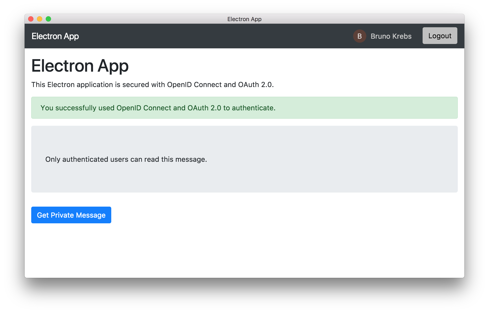

# Securing Electron Applications with OpenID Connect and OAuth 2.0

Learn how to secure your Electron applications using standards like OpenID Connect and OAuth 2.0.

This is the sample Electron project from the article published on Auth0 Blog: [How to Secure Electron Apps with OpenID Connect and OAuth 2.0](https://auth0.com/blog/securing-electron-applications-with-openid-connect-and-oauth-2/)

---
### Technology

This project uses the following technologies:

- [Node.js](https://nodejs.org/)
- [Electron](https://www.electronjs.org/)
- [Auth0](https://auth0.com/)

### Running the Demo

To run this project, follow these steps:

1. Clone this repository (`git clone https://github.com/auth0-blog/electron-openid-oauth`)
2. Move to the `electron-openid-oauth/backend`  folder in your machine and run `npm install`
3. [Register the API with Auth0](https://auth0.com/blog/securing-electron-applications-with-openid-connect-and-oauth-2/#Call-a-Secure-API-within-Electron)
4. Rename the `env-variables.json.template` config file into `env-variables.json` and fill the required Auth0 parameters
5. Launch the API by running `npm start`
6. Move to the `electron-openid-oauth/frontend`  folder in your machine and run `npm install`
7. [Register the Electron application with Auth0](https://auth0.com/blog/securing-electron-applications-with-openid-connect-and-oauth-2/#Register-an-Electron-Application-with-Auth0)
8. Rename the `env-variables.json.template` config file into `env-variables.json` and fill the required Auth0 parameters
9. Launch the Electron app by running `npm start`

The following is a screenshot of the Electron application screen after logging in and clicking the *Get Private Message* button:

[Read more](https://auth0.com/blog/securing-electron-applications-with-openid-connect-and-oauth-2/)

